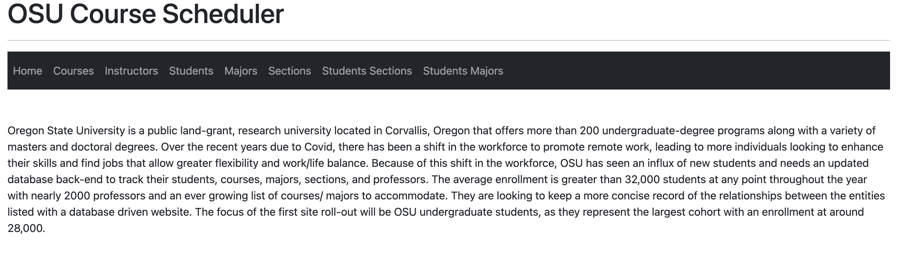
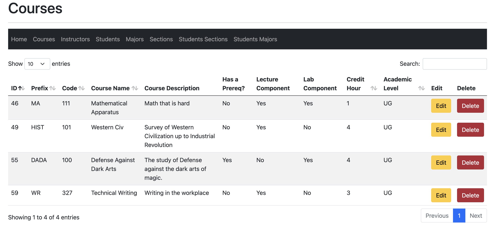
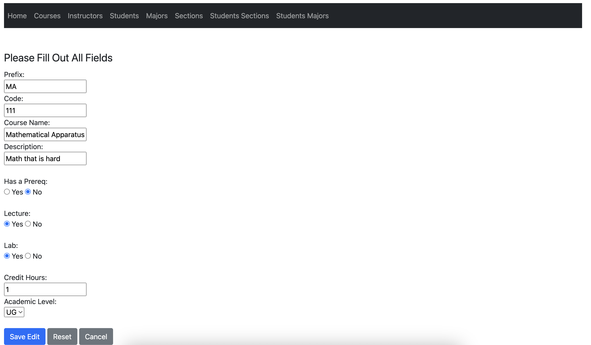
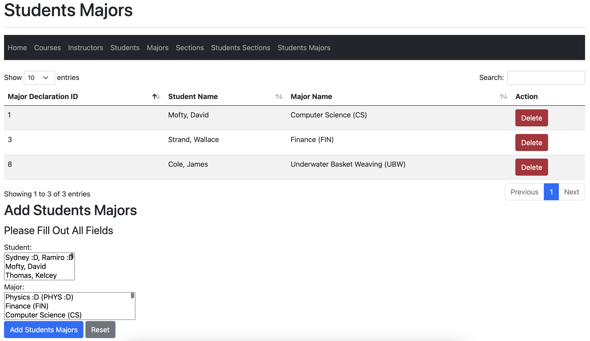

## Course Scheduling Web App

I plan to have this deployed in the next few weeks and will have a link available to check it out.

The GitHub repository for my course scheduling web app is a full-featured application that allows users to easily manage their course schedules. The app is built using **MySQL** as the database, and it provides full **CRUD** (create, read, update, delete) functionality. This allows users to:

- Add courses to their schedules
- View their current schedule
- Edit existing courses
- Delete courses from their schedules

The app is user-friendly and intuitive, making it easy for anyone to use. Overall, this repository is a valuable resource for anyone looking to manage their course schedules efficiently and effectively.

Below I have a few screenshots of the application for reference.

Home page with background on the university.

View of the main courses page where you can add, update, view, and delete.

Showing the Editing feature that all entities with edit enabled offers. These are prepopulated to help with data integrity.

This is one of the intersection tables that only displays the attributes from the associated entity tables when there is data.
